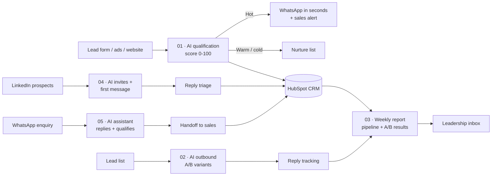

# AI Sales Automation Portfolio

Five working n8n workflows that make up an AI-powered sales funnel: capture and qualify leads, reach prospects on LinkedIn, answer WhatsApp enquiries around the clock, run personalized email outbound with A/B testing, and report pipeline health to leadership every week.

Built by **Hassan Ashraf**, a B2B sales professional who designs sales systems as well as selling. [LinkedIn](https://www.linkedin.com/in/hassan-ashraf-42823b103)

## The workflows

| # | Workflow | What it does | Stack |
|---|---|---|---|
| 01 | [AI lead qualification + instant follow-up](01-ai-lead-qualification) | Scores every new lead with AI, updates HubSpot, sends a personalized WhatsApp to hot leads straight away and alerts the sales team | n8n, Claude AI, HubSpot, WhatsApp Cloud API, Google Sheets |
| 02 | [AI outbound with A/B testing](02-ai-outbound-ab-testing) | Writes a personalized first email for each lead, splits leads between two messaging angles, sends through Gmail and logs replies by variant | n8n, Claude AI, Gmail, Google Sheets |
| 03 | [Weekly pipeline + A/B report](03-weekly-pipeline-dashboard) | Every Monday: pipeline by stage, win rate, stalled deals and A/B reply rates, with an AI summary and actions, emailed to leadership | n8n, HubSpot, Google Sheets, Claude AI |
| 04 | [LinkedIn AI outreach](04-linkedin-ai-outreach) | Sends connection requests with personal notes (capped daily), sends a first message when accepted, and sorts replies by intent with a suggested answer | n8n, Claude AI, Unipile (LinkedIn), Google Sheets |
| 05 | [WhatsApp AI assistant](05-whatsapp-ai-assistant) | Replies to WhatsApp enquiries 24/7 in English or Arabic, qualifies budget, area and timeline, and hands off to sales with a summary | n8n, Claude AI, WhatsApp Cloud API, Google Sheets |

## Design principles

- **Speed to lead.** Hot leads get a response while they're still interested, not the next morning.
- **AI drafts, rules decide.** AI scores and writes. Thresholds, send limits and routing stay under human control.
- **Measure everything.** Every message is tagged with its variant, so what works is backed by data rather than opinion.
- **Protect the channel.** Daily send caps, approved WhatsApp templates and plain-text emails keep domains and numbers healthy.
- **CRM is the source of truth.** Every lead and score ends up in HubSpot.

## How to run them

1. Install n8n (cloud, or self-hosted with `npx n8n`).
2. In n8n: **Workflows → Import from file** and choose a `workflow.json`.
3. Add credentials: Claude (an Anthropic API key, added as a Header Auth credential with header name `x-api-key`), HubSpot private app token, Google Sheets, Gmail, WhatsApp Cloud API (01, 05) and Unipile (04).
4. Replace every `PASTE_...` value in the Config and email nodes.
5. Each folder's README lists the sheet columns and the setup that workflow needs.
