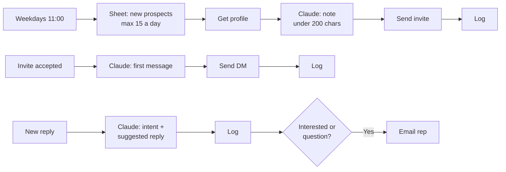

# 04 · LinkedIn AI Outreach: Invites, First Message + Reply Triage

**Problem:** LinkedIn is where Middle East investors and decision makers are, but personalized outreach by hand takes hours, and replies get missed.
**Solution:** Claude writes a personal connection note for each prospect and a first message when they accept. When they reply, it sorts the reply by intent, so the rep only handles the conversations that matter, with a suggested reply ready.

## Why Unipile

LinkedIn's official API doesn't allow sending connection requests or messages from a personal account. [Unipile](https://www.unipile.com) is a third-party API that connects your LinkedIn account (and WhatsApp, Instagram and Telegram) and gives n8n simple endpoints for profiles, invites, messages and webhooks.

## Setup

1. **Unipile:** create an account, connect your LinkedIn, and copy your **DSN** (API address), **API key** and **account ID**.
2. **n8n credential:** Header Auth with header name `X-API-KEY` and your Unipile key. Use it on every Unipile node.
3. **Config nodes** (there are two, one per trigger): fill in the DSN, account ID, your one-line offer and the email addresses.
4. **Webhooks in the Unipile dashboard:**
   - **Users → new relation** → your n8n `linkedin-accepted` webhook URL
   - **Messaging → message received** → your n8n `linkedin-message` webhook URL
5. **Google Sheet** tab `LinkedIn` with columns: `name, company, linkedin_url, notes, linkedin_status, provider_id, invite_note, invited_at, first_message, connected_at, reply_intent, reply_summary, phone, replied_at`. New prospects start with `linkedin_status = new`.

## Account safety

- **LinkedIn's terms:** they don't allow automation tools, so there is always some risk of your account being restricted. Use your own account, keep volumes low, and watch for warnings.
- **Daily cap:** the default is 15 invites a day (`daily_invite_limit`). Stay under roughly 100 a week, and start lower on a new or quiet account.
- **Invite notes:** kept under 200 characters, which is the limit for free accounts.
- **Accept detection:** LinkedIn doesn't send accept events instantly, so the first message can go out up to a few hours after acceptance. That's fine, and it reads more naturally than an instant reply.
- **Replies aren't automated:** Claude sorts replies and drafts a suggestion, but the rep sends the actual reply.
