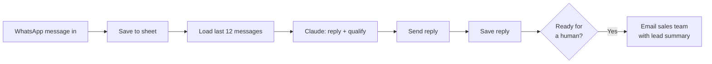

# 05 · WhatsApp AI Assistant: Instant Replies, Qualification + Human Handoff

**Problem:** in the Gulf, most property enquiries arrive on WhatsApp, often late at night and from click-to-WhatsApp ads. A slow reply loses the lead.
**Solution:** Claude replies within seconds, 24/7, in English or Arabic. It works out budget, area, property type and timeline one question at a time, remembers the conversation, and hands the lead to a human with a summary the moment they're ready.

## Rules built into the assistant

- **Never invents facts.** It won't make up prices, availability, returns or legal facts. It says an advisor will confirm.
- **One question at a time**, with replies under 60 words.
- **Hands off to a human** when the customer asks for a call, viewing, price list or a person, or once budget and timeline are known.
- **Text only.** Voice notes and images are left for a human.

## Setup

1. **Meta WhatsApp Cloud API:** in Meta for Developers, create an app with WhatsApp, add your business number and create a permanent access token.
2. **n8n credentials:**
   - **WhatsApp OAuth** for the WhatsApp Trigger. n8n registers the webhook and handles verification.
   - **Header Auth** `Authorization: Bearer <token>` for the Send node.
   - **Header Auth** `x-api-key` with your Anthropic key for the Claude node.
3. **Google Sheet** tab `WhatsApp` with columns: `at, phone, name, direction, text`.
4. **Email:** set the sender and sales team addresses in `Alert Sales Team`.

## Why the official API

This uses Meta's official WhatsApp Cloud API, not a personal number connected through a third-party tool. Business numbers on the official API don't risk being banned for automation. Replies within 24 hours of the customer's last message can be free text. After that, WhatsApp requires an approved template, which workflow 01 already uses.
