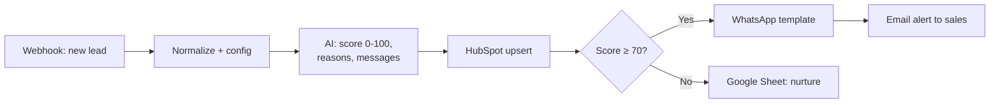

# 01 · AI Lead Qualification + Instant Multi-Channel Follow-up

**Problem:** inbound real estate leads go cold within minutes, and sales reps waste time on people who were only browsing.
**Solution:** every new lead is scored by AI the moment it arrives. Hot leads get a personalized WhatsApp message straight away and a rep is alerted. Everyone else goes into nurture. HubSpot is updated either way.

## What the AI returns

| Field | Use |
|---|---|
| `score`, `tier` | Routing (hot / warm / cold) and CRM lead status |
| `reasons` | Why the lead scored as it did, so the rep has context before calling |
| `whatsapp_line` | One personalized sentence placed into the approved WhatsApp template |
| `email_subject`, `email_body` | Ready-to-send nurture email |
| `next_best_action` | Suggested next step for the rep |

See [a full sample run](sample-run.md) of one lead going through this workflow.

## Setup

- **Lead source:** send a POST request to the webhook from your form, landing page or ads tool. Try it with `sample-lead.json`:
  `curl -X POST <webhook-url> -H "Content-Type: application/json" -d @sample-lead.json`
- **HubSpot:** create a private app with contacts write access. Create these custom contact properties: `ai_lead_score` (number), `ai_lead_tier`, `ai_score_reasons`, `ai_next_best_action`, `lead_source_detail` (text).
- **WhatsApp Cloud API:** WhatsApp only allows businesses to start a conversation with an approved template. Create a template called `new_lead_followup` with two body variables, for example:
  `Hi {{1}}, thanks for your enquiry. {{2}} Is now a good time for a quick call?`
  Put your phone number ID in the Config node and add the header `Authorization: Bearer <token>` as the credential.
- **Google Sheet** tab `Nurture` with columns: `received_at, name, email, phone, score, tier, reasons, email_subject, email_body`.
- **Threshold:** change `hot_score_threshold` in the Config node (default 70).
