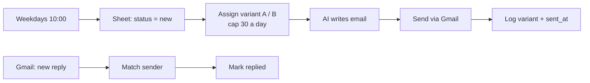

# 02 · AI-Personalized Outbound with A/B Testing + Reply Tracking

**Problem:** generic cold emails get ignored, and most teams never learn which message actually works.
**Solution:** every lead gets an email with a specific opening line written by AI. Leads alternate between two messaging angles, and replies are logged by variant, so the better angle is chosen from real reply rates.

## The two angles (edit them in `Assign A/B Variant`)

| Variant | Angle |
|---|---|
| A | Investment case: rental yield, capital growth, payment plans |
| B | Lifestyle and relocation: community, schools, commute, residency options |

Swap in any two angles, subject-line styles or calls to action. The report in workflow 03 compares reply rates automatically.

## Setup

- **Google Sheet** tab `Leads` with columns: `name, email, company, city, notes, status, variant, subject, sent_at, replied, replied_at`. New leads start with `status = new`.
- **Gmail** credential for sending and for the reply trigger.
- **Daily cap:** `DAILY_LIMIT` in `Assign A/B Variant` (default 30) protects the sending domain. Warm up new domains before raising it.
- **Guardrails in the prompt:** under 80 words, no compliments or filler, one question to close.
